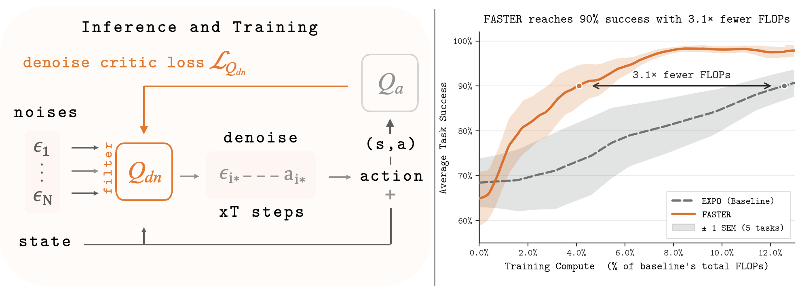

<div align="center">

# FASTER: Value-Guided Sampling for Fast RL

[Perry Dong](https://perryd.com/)<sup>\*</sup> &nbsp;·&nbsp;
[Alexander Swerdlow](https://aswerdlow.com/)<sup>\*</sup> &nbsp;·&nbsp;
[Dorsa Sadigh](https://dorsa.fyi/) &nbsp;·&nbsp;
[Chelsea Finn](https://ai.stanford.edu/~cbfinn/)

Stanford University

<a href="#citation"></a>

<sub><sup>*</sup>Equal contribution</sub>

<p>
  <a href="#setup"></a>
  <a href="#training"></a>
  <a href="#tasks"></a>
  <a href="#citation"></a>
</p>



</div>

---

## Overview

Many of the strongest RL algorithms today rely on **best-of-N action sampling** with a value critic — they pay to fully denoise *N* candidates and keep only one. **FASTER** recovers the gains of best-of-N without the same sampling cost.

FASTER frames best-of-N denoising as a Markov Decision Process over the diffusion trajectory and learns a **denoise critic** that scores candidates *before* denoising completes. At inference time we sample *N* noise seeds, rank them with the critic, and fully denoise only the top-ranked seed — collapsing inference cost to a single rollout regardless of *N*.

## Setup

Targets Python `3.10`, managed with [`uv`](https://docs.astral.sh/uv/). Dependencies are GPU-oriented and pinned in `pyproject.toml` (JAX CUDA 12 wheels, Robomimic, Robosuite).

```bash
uv sync
source .env
python scripts/download_robomimic_datasets.py
```

Training expects the Robomimic low-dimensional `low_dim_v141.hdf5` files under `$ROBOMIMIC_DATASETS_PATH`, which defaults to `datasets/robomimic` inside this repo. `python scripts/download_robomimic_datasets.py` pulls the pinned robomimic `low_dim_v141.hdf5` files for the supported tasks; in the pinned revision, `tool_hang` only has a `ph` split.

## Training Commands

<details>
<summary><b>Short FASTER-EXPO sanity run</b></summary>

```bash
source .env && python train_robo.py \
  --env_name=can \
  --seed=1 \
  --dataset_dir=mh \
  --utd_ratio=20 \
  --start_training=1 \
  --max_steps=2 \
  --diffusion=True \
  --eval_interval=1000000 \
  --offline_eval_interval=1000000 \
  --config=configs/sar_better_config.py \
  --config.hidden_dims='(256, 256, 256)' \
  --config.num_min_qs=2 \
  --config.T=5 \
  --config.filter_at_eval=True \
  --config.filter_temperature_eval_sampling_init=2.0 \
  --config.r_action_scale=0.15 \
  --config.N=8 \
  --config.train_N=8 \
  --config.ne_samples=1 \
  --config.ne_samples_train=1 \
  --project_name=sar_square_d0 \
  --log_dir=exp/test_sar_can_run
```
</details>

<details>
<summary><b>Online FASTER-EXPO on Robomimic Can</b></summary>

```bash
source .env && python train_robo.py \
  --dataset_dir=ph \
  --utd_ratio=20 \
  --start_training=5000 \
  --config=rlpd/agents/sac/sar_better_agent.py \
  --config.model_cls=BetterDiffusionSACLearner \
  --log_dir=exp \
  --seed=0 \
  --eval_interval=50000 \
  --max_steps=1000000 \
  --env_name=can \
  --config.filter_at_eval=True \
  --config.T=10 \
  --config.r_action_scale=0.15 \
  --config.filter_temperature_mode="zscore" \
  --config.filter_temperature_backup_init=1.0 \
  --config.filter_temperature_eval_sampling_init=0.0 \
  --checkpoint_model=True \
  --checkpoint_keep=2 \
  --checkpoint_buffer=True
```
</details>

<details>
<summary><b>Batch-online IDQL baseline</b></summary>

```bash
source .env && python train_batch.py \
  --env_name=square \
  --seed=1 \
  --eval_interval=1 \
  --dataset_dir=ph \
  --utd_ratio=20 \
  --pretrain_r=False \
  --pretrain_q=False \
  --pretrain_steps=0 \
  --start_training=0 \
  --max_steps=1000000 \
  --trajs_per_update=1 \
  --max_iter=3 \
  --eval_episodes=1 \
  --grad_updates_per_iter=1 \
  --diffusion=True \
  --config=configs/idql_config.py \
  --config.backup_entropy=False \
  --config.deterministic_ddim_eta0=True \
  --config.hidden_dims="(256, 256, 256)" \
  --config.T=100 \
  --config.N=8 \
  --config.train_N=8 \
  --config.expectile=0.8 \
  --project_name=sar_idql
```
</details>

All released commands use `WANDB_MODE=offline`. Batch-online commands additionally set `XLA_PYTHON_CLIENT_PREALLOCATE=false`.

## Outputs

Each run creates a timestamped directory under `--log_dir`, e.g.:

```text
exp/2026_04_17__12_34_56__s0/
├── flags.json
├── train.csv
├── eval.csv
├── checkpoints/   # if --checkpoint_model=True
└── buffers/       # if --checkpoint_buffer=True
```

## Acknowledgements

The training infrastructure builds on [RLPD](https://github.com/ikostrikov/rlpd), [IDQL](https://github.com/philippe-eecs/IDQL), and [Robomimic](https://robomimic.github.io/). We thank the authors for their open-source releases.

## Citation

```bibtex
@article{dong2026faster,
  title   = {FASTER: Value-Guided Sampling for Fast RL},
  author  = {Dong, Perry and Swerdlow, Alexander and Sadigh, Dorsa and Finn, Chelsea},
  journal = {arXiv preprint},
  year    = {2026}
}
```
